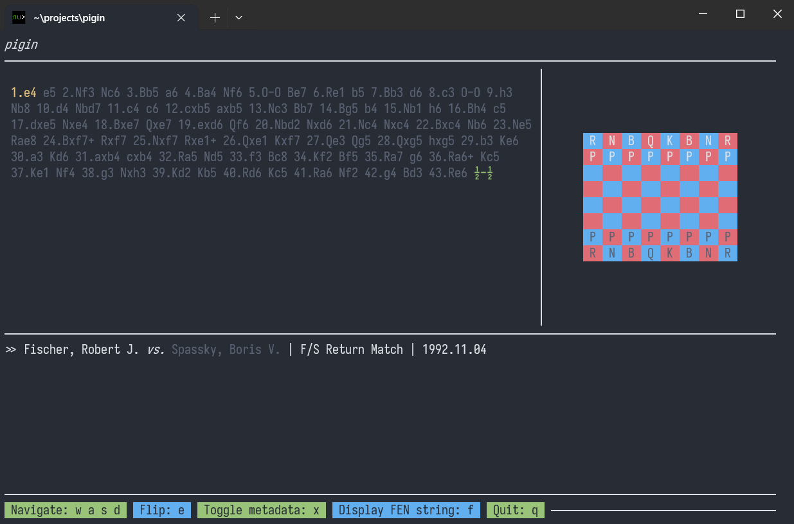

# pigin

[](https://github.com/sarsapar1lla/pigin/actions/workflows/workflow.yaml)

Chess visualisation TUI

## About



`pigin` is a TUI application for visualising chess games via [Portable Game Notation](https://en.wikipedia.org/wiki/Portable_Game_Notation)
using the [`ratatui` framework](https://ratatui.rs/).

## Installation

`pigin` can be installed from source using `cargo`:

```bash
$ cargo install --git https://github.com/sarsapar1lla/pigin
```

## Usage

Visualise a single file using:

```bash
$ pigin --file game.pgn
```

Or several files using:

```bash
$ pigin --file pgns/game1.pgn pgns/game2.pgn ...
```

## Local development

Compile the project using `cargo`:

```bash
$ cargo build
```

Run all tests using:

```bash
$ cargo test
```
